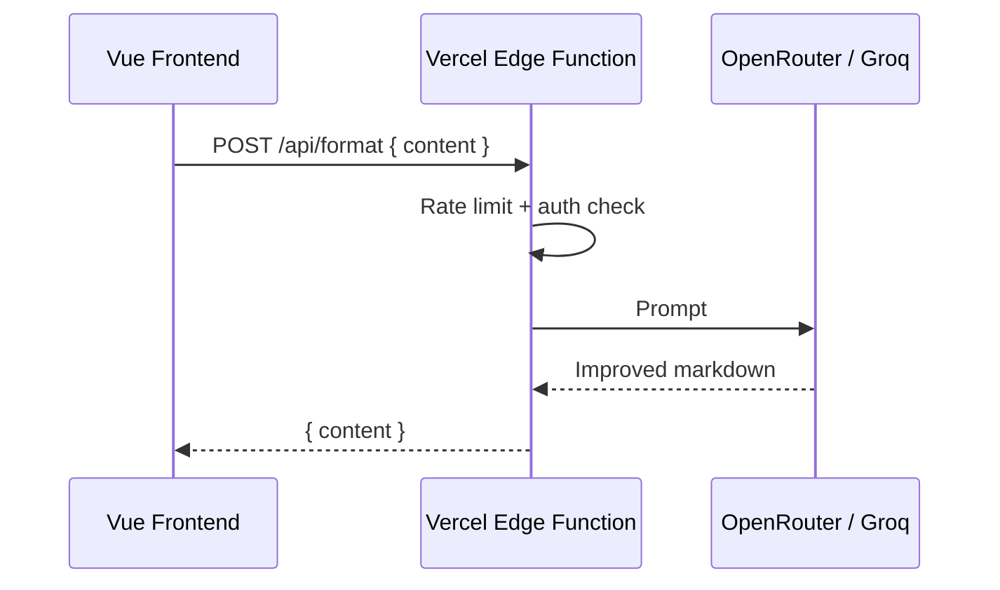

# AI-форматирование markdown (перспектива)

## Задача

По клику улучшить структуру markdown: заголовки, списки, блоки кода — без изменения смысла.

## Архитектура

**Никогда не вызывать LLM с фронта** — API-ключ окажется в браузере.

## Сравнение провайдеров (pet-проект, малая аудитория)

| Решение                                            | Стоимость                  | Сложность | Вердикт                 |
| -------------------------------------------------- | -------------------------- | --------- | ----------------------- |
| Vercel Edge + OpenRouter (Gemini Flash / DeepSeek) | ~$0.01–0.05 / 100 запросов | Низкая    | **Лучший выбор**        |
| Supabase Edge Function + тот же API                | Free tier                  | Средняя   | Если всё в Supabase     |
| Groq (Llama 3) free tier                           | Бесплатно, лимиты          | Низкая    | Прототип                |
| OpenAI GPT-4o                                      | Дорого                     | Низкая    | Избыточно               |
| Cloudflare Workers AI                              | $5/мес credits             | Средняя   | Если Cloudflare в стеке |

## Защита от злоупотреблений

- Rate limit: 5–10 запросов/час на IP (Upstash Redis free tier)
- Max input: 10 000 символов
- Приоритет авторизованным; 3 бесплатных для анонимов
- Позже: Cloudflare Turnstile

## Промпт (черновик)

> Улучши структуру markdown: заголовки, списки, блоки кода. Не меняй смысл и факты. Верни только markdown без пояснений.

## Оценка бюджета

50 пользователей × 5 форматирований/мес × ~2K токенов ≈ **$0.50–2/мес** (Gemini Flash через OpenRouter).

## UI

Кнопка «Улучшить» рядом с редактором → loading state → замена content с возможностью Undo (хранить предыдущую версию в ref на 30 сек).
