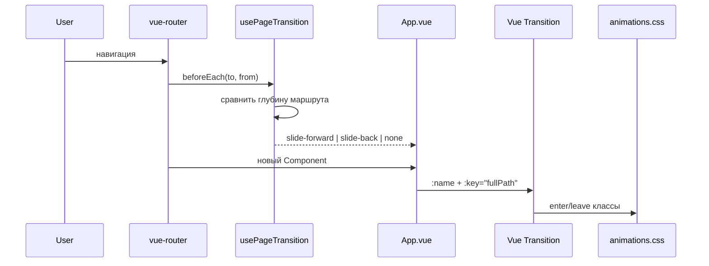

# Page transitions (перспектива)

## Задача

При смене маршрута страницы «листаются» горизонтально:

- **вперёд** (landing → write → dashboard → note): старая уезжает влево, новая заезжает справа;
- **назад** — зеркально;
- опционально: слои внутри страницы догоняют с инерцией (parallax / overshoot).

Header и нижняя навигация остаются на месте.

## Порядок маршрутов

```
landing (0) → create / write (1) → dashboard (2) → view / note (3)
```

Без анимации:

- первая загрузка;
- `not-found`;
- смена slug у той же заметки (`view` → `view`).

## Архитектура (Vue)



### Точка входа — `App.vue`

```vue
<RouterView v-slot="{ Component, route: pageRoute }">
  <Transition :name="transitionName" :appear="false">
    <component :is="Component" :key="pageRoute.fullPath" />
  </Transition>
</RouterView>
```

`:appear="false"` — без анимации при первом открытии сайта.

### Наша логика — `usePageTransition`

Composable с `router.beforeEach`: по `ROUTE_ORDER` выставляет `transitionName` до смены компонента.

### Визуал — CSS

- **enter страницы**: `@keyframes` с лёгким overshoot (перелёт мимо центра → возврат);
- **leave страницы**: простой `transition` без отскока;
- **слои**: `[data-parallax="1|2|3"]` — отдельные keyframes + `animation-delay` по глубине.

Контейнер `.main`: `position: relative`, `overflow-x: clip`, `min-height` под высоту viewport.

## Что пробовали (июнь 2026)

1. **Базовый slide** (`slide-forward` / `slide-back`) — текущая реализация.
2. **Overshoot страницы + parallax слоёв** (`data-parallax`, keyframes с задержкой) — визуально перегружено, откатили; идеи ниже на будущее.

## Идеи на следующую итерацию

| Направление                 | Комментарий                                                                        |
| --------------------------- | ---------------------------------------------------------------------------------- |
| Только slide, без overshoot | Проще, меньше конфликтов с `animate-fade-up` на landing                            |
| Меньший сдвиг               | `translateX(40%)` вместо `100%` — мягче, меньше «мобильного карусельного» ощущения |
| Parallax только на landing  | Два столбца hero — самый заметный выигрыш                                          |
| `PageShell`                 | Общая обёртка со слотами вместо `data-parallax` на каждой странице                 |
| View Transitions API        | Браузерный `document.startViewTransition` — другой стиль, меньше контроля по слоям |
| `prefers-reduced-motion`    | Fade 150ms вместо slide                                                            |

## Конфликты с существующими анимациями

- Landing: `animate-fade-up`, `animate-fade-up-delayed`
- View: `fade-up` на `.container`

При route enter нужно либо отключать mount-анимации (`animation: none` внутри `*-enter-active`), либо убрать их со страниц, куда всегда приходят через роутер.

## Сравнение с React

В Vue `<Transition>` в ядре: сам держит leaving-элемент в DOM и вешает CSS-классы. В React обычно Framer Motion / `react-transition-group` или View Transitions API. Логика направления (`usePageTransition`) переносима один в один.

## Черновик файлов (для восстановления)

```
src/app/lib/usePageTransition.ts   — composable, ROUTE_ORDER, beforeEach
src/app/App.vue                    — RouterView + Transition
src/app/styles/animations.css      — slide-*, page-enter-*, parallax-*
```

Разметка слоёв (если вернём parallax):

- Landing: copy `1`, preview `2`
- Write: title `1`, workspace `2`
- Dashboard: top `1`, list / empty `2`
- View: meta+title `1`, body `2`, footer `3`
